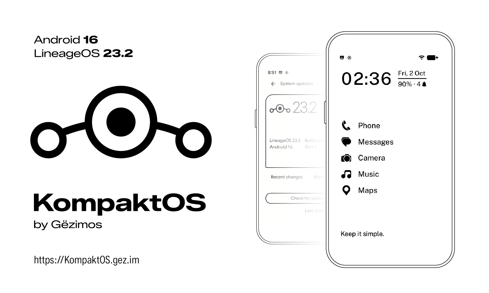

<a href="https://kompaktos.gez.im"></a>

# KompaktOS

<a href="https://buymeacoffee.com/gezimos"></a>

An unofficial build of LineageOS 23.2 (Android 16) for the Mudita Kompakt:
MT6761, 480x800 e-ink at 213dpi, dual SIM. It is not affiliated with or
supported by LineageOS.

Each release is one update package with our kernel and the LineageOS recovery,
our vendor, and the system built here, installed from that recovery with
`adb sideload`. This repository builds the system image. It is
built from LineageOS's generic system (GSI) target, which is why the same image
also boots on Mudita's kernel and vendor. The kernel, recovery, vendor and the
update package tooling live in
[KompaktDevice](https://github.com/gezimos/KompaktDevice).

## What it adds

- **E-ink interface**: black and white, with no greys, translucency or
  animations.
- **E-ink modes**, including Auto (fast while moving, clean when still), for the
  whole phone or per app, with per-app colour inversion.
- **Always-on display** that lets the phone sleep.
- **Sleep screen** with a picture of your own.
- **Fingerprint gestures**: scrolling, taps and holds, and keys for Key Mapper.
- **Notification light**, a colour per app.
- **Offline+**, the physical switch.
- **Battery**: charge limit, cycle count and health.
- **eSIM** profiles, **FM radio** and the **front camera**.
- **Calls over 4G** on every SIM, once MediaTek's IMS app is installed.

The full list, with what does not work yet, is at
[kompaktos.gez.im](https://kompaktos.gez.im/features/what-works).

## Editions

Each release has four update packages: two editions for two phones.

- **GApps** has Google Play services and the Play Store. **Vanilla** has no
  Google services.
- **Global and North American** Kompakts run different modem firmware, so the
  vendor image comes in two versions; the system image is the same for both. A
  North American phone needs its own package, or calls over 4G never connect.

Which one to take: [Editions](https://kompaktos.gez.im/install/editions).

## Build

```bash
STOCK_SYSTEM=<MuditaOS K 1.6.0 system.img> bash build.sh [/path/to/tree]
```

`STOCK_SYSTEM` is Mudita's system image, from their 1.6.0 update package: the
power-off charging screen is taken from it, since this repository does not carry
Mudita's binaries.

About 250 GB of disk. First sync takes hours; later builds are 10 to 40 minutes.

`build.sh` syncs LineageOS `lineage-23.2`, clones
[MisterZtr/treble_manifest](https://github.com/MisterZtr/treble_manifest) as the
local manifest, applies the patch series, copies `vendor/kompakt` in, clones and
patches OpenEUICC, and builds `lineage_arm64_bgN4-bp4a-userdebug`. `bvN4` is the
vanilla (no GApps) target.

## Layout

```
patches/kompakt/<project>/NNNN-*.patch    format-patch series, one directory per project
patches/apply-patches.sh                  git am, project by project
patches/README.md                         what each patch does, where the code does not say
vendor/kompakt/                           ours outright: overlays, KompaktService, prebuilts
vendor/kompakt/README.md                  the reasons behind vendor/kompakt
prebuilts/                                build inputs that must stay outside vendor/
local_manifests/                          anything beyond MisterZtr's manifest
```

The patches are a series with messages, not one squashed diff per project: when
upstream moves, a series can be rebased and a conflicting patch names the change
it belongs to. Each series applies with `git am` to a freshly synced tree, and a
clean tree plus the series reproduces what ships byte for byte.

## Signing

No keys here, ever. Put your own in `vendor/lineage-priv/keys/`, with a
`keys.mk` that sets the certificate; LineageOS picks that file up by itself.
Without keys the tree builds with the AOSP test keys, so it builds as-is.
`signing.md` has the layout and why it must be that exact path.

## Installing

KompaktOS installs from the LineageOS recovery, as one update package with the
kernel, vendor and system. The guide is at
[kompaktos.gez.im](https://kompaktos.gez.im).

## Credits

[LineageOS](https://github.com/LineageOS) ·
[phhusson](https://github.com/phhusson) and
[TrebleDroid](https://github.com/TrebleDroid) ·
[MisterZtr](https://github.com/MisterZtr) for the LineageOS GSI and its
manifest · [MP01Experiments](https://github.com/MP01Experiments/MP01-LineageGSI)
for the repository layout.
